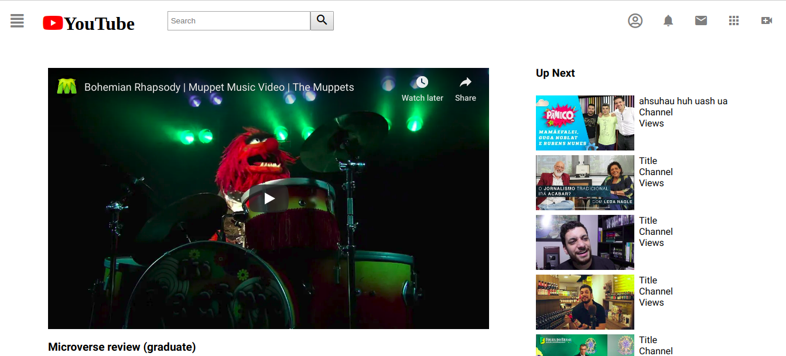

# Embedding Images and Video (YouTube Clone)

This is the first project of the Main HTML/CSS curriculum at [Microverse](https://www.microverse.org/) - @microverseinc
* The goal was to recreate a YouTube page 
* The project was completed using simple html and css 

#### [Assignment link](https://www.theodinproject.com/courses/html5-and-css3/lessons/embedding-images-and-video)
#### [Live link](https://bolabuari.com/youtube-clone)

#### ScreenShot

#### Authors

* [@TorresChief](https://github.com/TorresChief)
* [@bolah2009](https://github.com/bolah2009/)

#### Contact
* [Web](https://bolabuari.com/)  -  [Twitter](https://twitter.com/bolah2009)  -  [GitHub](https://github.com/bolah2009/)  -  [GitLab](https://gitlab.com/bolah2009/)  -  [LinkedIn](https://www.linkedin.com/in/bolah2009/)
